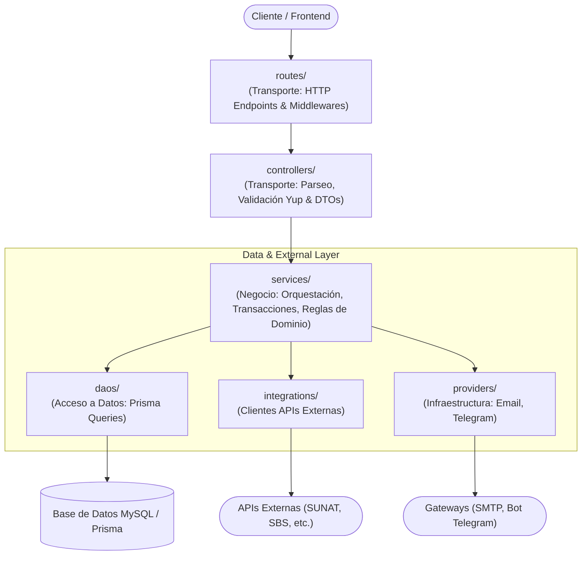

# Arquitectura por Capas — `ft-app-backend`

Este documento describe la arquitectura modular y por capas implementada en el backend de Factoring, asegurando separación de responsabilidades, alta cohesión y bajo acoplamiento.

---

## 🏛️ Mapa de Capas y Responsabilidades

---

## 📋 Matriz de Responsabilidades y Reglas de Importación

| Capa / Directorio | Tipo de Capa | Responsabilidad Principal | Puede Importar de | NO Puede Importar de |
|---|---|---|---|---|
| **`routes/`** | Transporte | Define los endpoints HTTP, aplica middlewares de autenticación (`isAuth`) y roles (`isRole`), y envuelve handlers con `catchedAsync`. | `controllers/`, `middlewares/` | `services/`, `daos/`, `models/`, `providers/` |
| **`controllers/`** | Transporte | Extrae parámetros (`params`, `body`, `query`, `session_user`), valida esquemas Yup, delega al servicio correspondiente y formatea la respuesta con `response(res, status, data)`. | `services/`, `utils/`, DTOs de servicios | `daos/`, `models/prisma`, `providers/`, `integrations/` |
| **`services/`** | Negocio / Dominio | Contiene toda la lógica de negocio pura, orquestación transaccional (`$transaction`), reglas de validación de negocio, llamadas a DAOs, providers e integraciones. | `daos/`, `integrations/`, `providers/`, `models/`, `utils/`, `constants/` | `express` (`Request`, `Response`), `controllers/`, `routes/` |
| **`daos/`** | Acceso a Datos | Consultas y mutaciones directas a Prisma (`prismaFT` o `tx`). No contiene lógica de negocio ni validaciones complejas. | `models/`, `types/`, Prisma Client | `controllers/`, `services/`, `integrations/`, `providers/` |
| **`integrations/`** | Servicios Externos | Clientes HTTP que consumen APIs de terceros (Decolecta, APIsPerú, SBS, etc.). | `utils/`, `config/`, `types/` | `controllers/`, `services/`, `daos/` |
| **`providers/`** | Infraestructura | Clientes y emisores de canales de comunicación e infraestructura (Email, Telegram). | `utils/`, `config/`, `templates/` | `controllers/`, `routes/`, `daos/` |
| **`utils/`** | Utilidades | Funciones utilitarias transversales y puras (fechas, strings, formato JSON, crypto, logs). | Librerías estándar y utilitarias puras | `controllers/`, `services/`, `daos/` |
| **`scripts/`** | CLI / Tareas | Scripts ejecutables en producción para procesos programados (cron jobs, sincronización de tipo de cambio, mailing en frío). | `services/`, `utils/`, `config/` | `controllers/`, `routes/` |
| **`jobs/`** *(futuro)* | Tareas en Segundo Plano | Tareas programadas desacopladas con programadores tipo cron/agenda. | `services/`, `utils/`, `config/` | `controllers/`, `routes/` |
| **`queues/`** *(futuro)* | Colas de Procesamiento | Workers y colas asíncronas (BullMQ/Redis). | `services/`, `providers/` | `controllers/`, `routes/` |
| **`webhooks/`** *(futuro)* | Receptores de Eventos | Endpoints dedicados para recibir webhooks de pasarelas de pago y proveedores. | `services/` | `daos/` |
| **`events/`** *(futuro)* | Event Bus | Bus de eventos desacoplado en memoria o mensajería (EventEmitter / Kafka / RabbitMQ). | `services/`, `providers/` | `controllers/` |

---

## 🗂️ Organización de `services/` por Perfil de Usuario

Para evitar colisiones de nombres y mantener clara la separación de dominios según los roles de la aplicación, los servicios se organizan en los siguientes submódulos:

- `services/admin/`: Operaciones exclusivas del perfil Administrador (verificación de empresas e inversionistas, mantenimiento de límites, configuraciones globales, SPLAFT, simulaciones factoring).
- `services/empresario/`: Operaciones del portal Empresario (gestión de facturas, solicitudes de factoring, liquidaciones, transferencias cedente, cuentas bancarias).
- `services/financiero/`: Operaciones del portal Financiero (evaluación de propuestas, liquidaciones, aprobaciones, tipo de cambio).
- `services/inversionista/`: Operaciones del portal Inversionista (gestión de inversiones, cuentas bancarias asociadas).
- `services/usuario/`: Operaciones de usuario común (perfil personal, verificación de identidad con DNI/selfie, credenciales, menús, suscripción a servicios).
- `services/secure/`: Seguridad global, autenticación JWT, registro, recuperación de contraseñas y OTP.
- `services/`: Servicios transversales o compartidos de alto nivel (`factoring.Service.ts`, `tipocambio.Service.ts`, `health.Service.ts`, etc.).

---

## ⛔ Reglas de Oro para Desarrolladores

1. **El Controlador es delgado y pasivo:**
   - Su única misión es recibir la petición HTTP, validar la estructura de los datos con Yup, delegar al servicio correspondiente y retornar la respuesta con el código HTTP apropiado.
   - **NUNCA** debe importar de `src/daos/` ni de `src/models/prisma/`.
   - **NUNCA** debe abrir transacciones de base de datos (`$transaction`).

2. **El Servicio es agnóstico del protocolo:**
   - **NUNCA** recibe `req` ni `res` de Express.
   - Recibe valores primitivos o DTOs tipados (`idusuario: number`, `payload: MiPayload`).
   - Lanza excepciones de dominio (`ClientError`) cuando una regla de negocio o existencia falla.

3. **Capa de Notificaciones en Providers:**
   - Ningún controlador invoca directamente proveedores de mensajería (Telegram, SendGrid, SMTP). La notificación es parte de la orquestación del caso de uso en el servicio.
