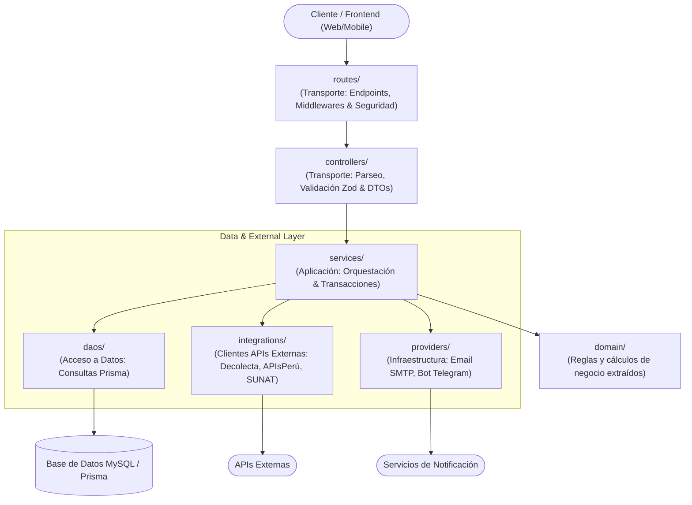

# Arquitectura por Capas — `ft-app-backend`

Este documento describe la arquitectura modular y por capas implementada en el backend de Factoring, asegurando estricta separación de responsabilidades, alta cohesión, bajo acoplamiento y desacoplamiento total de los controladores HTTP respecto a la persistencia e infraestructura.

---

## 🏛️ Mapa de Capas y Flujo de Información

```mermaid
flowchart TD
    Client(["Cliente / Frontend (Web/Mobile)"]) --> Routes["routes/\n(Transporte: Endpoints, Middlewares & Seguridad)"]
    Routes --> Controllers["controllers/\n(Transporte: Parseo, Validación Zod & DTOs)"]
    Controllers --> Services["services/\n(Aplicación: Orquestación & Transacciones)"]
    Services --> Domain["domain/\n(Reglas y cálculos de negocio extraídos)"]
    
    subgraph Data & External Layer
        Services --> DAOs["daos/\n(Acceso a Datos: Consultas Prisma)"]
        Services --> Integrations["integrations/\n(Clientes APIs Externas: Decolecta, APIsPerú, SUNAT)"]
        Services --> Providers["providers/\n(Infraestructura: Email SMTP, Bot Telegram)"]
    end

    DAOs --> DB[(Base de Datos MySQL / Prisma)]
    Integrations --> ExternalAPIs(["APIs Externas"])
    Providers --> NotificationGateways(["Servicios de Notificación"])
```

---

## 📋 Matriz de Responsabilidades y Reglas de Importación

| Capa / Directorio | Tipo de Capa | Responsabilidad Principal | Puede Importar de | NO Puede Importar de |
|---|---|---|---|---|
| **`routes/`** | Transporte | Define rutas HTTP, asocia middlewares de autenticación (`isAuth`), autorización por rol (`isRole`) y envuelve handlers con `catchedAsync`. | `controllers/`, `middlewares/` | `services/`, `daos/`, `models/`, `providers/` |
| **`controllers/`** | Transporte | **Capa delgada**: Extrae parámetros (`params`, `body`, `query`, `session_user`), valida esquemas Zod/DTOs, delega al servicio correspondiente y devuelve respuesta con `response(res, status, data)`. | `services/`, `utils/`, DTOs/esquemas | `daos/`, `models/prisma`, `providers/`, `integrations/`, llamadas a transacciones Prisma |
| **`services/`** | Aplicación | Orquesta casos de uso y transacciones (`$transaction`), obtiene datos mediante DAOs y delega los cálculos extraídos a `domain/`. Los módulos pendientes de extracción todavía contienen reglas de negocio. Agnóstico al transporte HTTP. | `domain/`, `daos/`, `integrations/`, `providers/`, `models/`, `utils/`, `constants/` | `express` (`Request`, `Response`), `controllers/`, `routes/` |
| **`domain/`** | Dominio | Reglas y cálculos de negocio independientes de persistencia. Recibe parámetros y configuración como datos y devuelve resultados sin efectos secundarios. | Tipos compartidos mediante `import type`, librerías de cálculo y fechas | `services/`, `daos/`, `models/prisma`, `providers/`, `integrations/`, `controllers/`, `routes/` |
| **`daos/`** | Acceso a Datos | Consultas y mutaciones directas a Prisma (`prismaFT` o cliente transaccional `tx`). No contiene reglas de negocio. | `models/`, `types/`, Prisma Client | `controllers/`, `services/`, `integrations/`, `providers/` |
| **`integrations/`** | Servicios Externos | Adaptadores para APIs de terceros que alimentan el dominio (Decolecta, APIsPerú, SUNAT, SBS). | `utils/`, `config/`, `types/` | `controllers/`, `services/`, `daos/` |
| **`providers/`** | Infraestructura | Clientes técnicos para canales de notificación (Email SMTP, Telegram). Efectos secundarios de entrega. | `utils/`, `config/`, `templates/` | `controllers/`, `routes/`, `daos/` |
| **`utils/`** | Utilidades | Funciones puras y reutilizables (formato de números, fechas, crypto, logs Pino). | Librerías estándar | `controllers/`, `services/`, `daos/` |
| **`scripts/`** | CLI / Crons | Tareas ejecutables (sincronización de tipo de cambio, envío de emails programados). | `services/`, `utils/`, `config/` | `controllers/`, `routes/` |

---

## 🗂️ Mapa y Organización de `services/`

El directorio `src/services/` se divide entre servicios **Core transversales** y servicios **Especializados por Rol/Actor**:

### 1. Servicios Core Transversales (`src/services/`)
- `factoring.Service.ts`: Obtiene configuraciones y riesgo mediante DAOs dentro de transacciones y delega los cálculos a `domain/factoring/factoring.Calculator.ts`. Conserva las funciones públicas `simulateFactoringLogicV1/V2/V3/V4` para los servicios consumidores.
- `tipocambio.Service.ts`: Sincronización y consulta del tipo de cambio SBS y SUNAT.
- `archivo.Service.ts` / `archivofactura.Service.ts`: Gestión base de almacenamiento físico y metadatos de archivos.
- `empresa.Service.ts` / `persona.Service.ts` / `contacto.Service.ts`: Mantenimiento y validación de entidades principales.
- `cedentelimite.Service.ts` / `factorlimite.Service.ts` / `pagadorlimite.Service.ts`: Gestión de límites y aforos crediticios.
- `cuentabancariaestado.Service.ts`: Validación y transiciones de cuentas bancarias.
- `emailVentaFrio.Service.ts`: Servicio para campañas de prospección automatizada.
- `health.Service.ts`: Chequeo de salud del servicio y conectividad a base de datos.

### 2. Servicios por Rol (`src/services/[rol]/`)

#### `src/services/admin/` (Panel Administrativo y Backoffice)
- `factoring.Service.ts`: Auditoría, control de operaciones de factoring y autorizaciones generales.
- `factoringpropuesta.Service.ts`: Simulación, creación, activación y aprobación de propuestas administrativas.
- `factoringliquidacion.Service.ts`: Simulación, generación de liquidaciones financieras, cálculo de mora/pronto pago y emisión de liquidación en PDF.
- `factoringfacturafactor.Service.ts`: Asociación y desasociación de facturas asignadas al factor.
- `factoringhistorialestado.Service.ts`: Trazabilidad y auditoría de cambios de estado en operaciones.
- `factoringpropuestahistorialestado.Service.ts`: Historial de estados y revisiones de propuestas.
- `factoringtransferenciacedente.Service.ts`: Control de transferencias y pagos directos a cedentes.
- `factoringsimulacion.Service.ts`: Simulaciones exploratorias de riesgo y escenarios de tasa.
- `accionista.Service.ts`, `funcionario.Service.ts`, `registrooperacion.Service.ts`, `zlaboratorio.Service.ts`.

#### `src/services/financiero/` (Módulo Financiero / Operaciones)
- `factura.Service.ts`: Carga de comprobantes XML/PDF, activación, inactivación y consulta de facturas.
- `factoring.Service.ts`: Gestión financiera de operaciones y solicitudes.
- `factoringpropuesta.Service.ts`: Generación y revisión de propuestas comerciales.
- `factoringliquidacion.Service.ts`: Procesamiento y aprobación de liquidaciones para factoring.
- `factoringfacturafactor.Service.ts`: Validación de facturas y vinculación de factores.
- `factoringhistorialestado.Service.ts` / `factoringpropuestahistorialestado.Service.ts`: Control de flujo de estados.
- `factoringtransferenciacedente.Service.ts`: Registro y validación de transferencias bancarias a cedentes.
- `sbstipocambio.Service.ts` / `sunattipocambio.Service.ts`: Integración con fuentes oficiales de tipo de cambio.

#### `src/services/empresario/` (Portal del Cedente)
- `factura.Service.ts`, `factoring.Service.ts`, `factoringpropuesta.Service.ts`, `factoringliquidacion.Service.ts`, `factoringtransferenciacedente.Service.ts`, `factoringfacturafactor.Service.ts`, `contacto.Service.ts`, `empresacuentabancaria.Service.ts`, `usuarioservicioempresa.Service.ts`.

#### `src/services/inversionista/` (Portal del Inversionista)
- `factoring.Service.ts`: Oportunidades de inversión en operaciones activas.
- `inversionistacuentabancaria.Service.ts`: Cuentas bancarias de abono y rescate.

#### `src/services/usuario/` (Gestión de Usuario y Cuenta)
- `archivo.Service.ts`: Carga segura con verificación de MIME types reales (`file-type`), tamaños y eliminación.
- `persona.Service.ts`, `usuario.Service.ts`, `credencial.Service.ts`, `menu.Service.ts`, `usuarioservicio.Service.ts`.

#### `src/services/secure/` (Autenticación y Seguridad)
- `secure.Service.ts`: Inicio de sesión, generación y verificación de JWT, recuperación de contraseñas y códigos OTP.

---

## Dominio de factoring (`src/domain/factoring/`)

`factoring.Calculator.ts` contiene funciones síncronas para las fórmulas históricas V1/V2 y las fórmulas V3 usadas por V4, además del cálculo de días y fechas. Conserva los redondeos, porcentajes y diferencias entre versiones; no consulta DAOs, abre transacciones ni registra logs.

El servicio recibe los identificadores de riesgo, consulta la configuración y entrega al calculador dos objetos tipados: los parámetros de la operación y la configuración financiera. El calculador puede probarse directamente sin mocks de Prisma o de DAOs.

La extracción es incremental: los demás servicios conservan su estructura actual. Los tipos de salida `Simulacion` y sus conceptos financieros siguen siendo compartidos y están definidos a partir de tipos generados por Prisma; el dominio los importa solo como tipos. `Decimal` se conserva desde el runtime de Prisma para mantener la precisión y compatibilidad existentes, sin instanciar un cliente de base de datos.

---

## 🛡️ Auditoría Arquitectónica y Estado de Desacoplamiento

El sistema cuenta con una verificación estricta de separación de capas:

- **100% de controladores desacoplados**: Ningún controlador en `src/controllers/` realiza importaciones de DAOs (`from.*daos/`), llamadas directas a Prisma Client / `$transaction`, ni invoca clientes de infraestructura (`providers/`).
- **Controladores delgados**: Los controladores únicamente actúan como adaptadores de entrada HTTP que parsean parámetros, validan tipos/esquemas, delegan la lógica a los servicios y retornan las respuestas HTTP estandarizadas.
- **Transaccionalidad en Servicios**: La orquestación de transacciones atómicas (`prismaFT.client.$transaction`) reside íntegramente dentro de los servicios de aplicación.

---

## 🧪 Pruebas Unitarias Automatizadas (`tests/vitest/migrated/unit/`)

La arquitectura está respaldada por una suite de pruebas automatizadas con Vitest y TypeScript, libre de dependencias de bases de datos vivas mediante mocking de DAOs y Prisma:

- **`tests/vitest/migrated/unit/services/usuario/archivo.Service.test.ts`**: Pruebas de validación de extensiones, límites de peso, detección MIME real y borrado seguro.
- **`tests/vitest/migrated/unit/services/financiero/factura.Service.test.ts`**: Verificación de delegación correcta de consultas, altas y bajas de facturas.
- **`tests/vitest/migrated/unit/services/admin/factoringpropuesta.Service.test.ts`**: Verificación de cálculos de propuesta y simulación financiera.
- **`tests/vitest/migrated/unit/services/admin/factoringliquidacion.Service.test.ts`**: Precisión de fórmulas financieras para pronto pago y mora.
- **`tests/vitest/migrated/unit/services/factoring.Service.test.ts`**: Simulación de tasas efectivas y condiciones contractuales.
- **`tests/vitest/migrated/unit/domain/factoring/factoring.Calculator.test.ts`**: Cálculos sin base de datos, cargos por moneda y banco, descuentos, redondeos históricos y fechas.
- **`tests/vitest/migrated/unit/services/tipocambio.Service.test.ts`**: Normalización de fechas Lima UTC y generadores de código.

---

## ⛔ Reglas de Oro para Mantener la Arquitectura

1. **El Controlador es delgado y pasivo:**
   - Su única misión es recibir la petición HTTP, validar la estructura con Zod, llamar al servicio y responder al cliente con `response(res, status, data)`.
   - **NUNCA** debe importar de `src/daos/` ni de `src/models/prisma/`.
   - **NUNCA** debe abrir transacciones de base de datos (`$transaction`).

2. **El Servicio es agnóstico del protocolo:**
   - **NUNCA** recibe `req` ni `res` de Express.
   - Recibe tipos primitivos o DTOs tipados.
   - Lanza excepciones de dominio (`ClientError`) cuando una regla de negocio o existencia falla.

3. **Capa de Notificaciones en Providers:**
   - Ningún controlador invoca directamente proveedores de mensajería (Telegram, SendGrid, SMTP). La notificación es parte de la orquestación del caso de uso en el servicio.

4. **El dominio recibe datos y calcula:**
   - Las fórmulas extraídas a `domain/` no consultan DAOs ni abren transacciones.
   - Los servicios obtienen la configuración y delegan el cálculo; no duplican las fórmulas.
   - Las utilidades genéricas permanecen en `utils/`; las reglas propias de factoring pertenecen a `domain/factoring/`.
